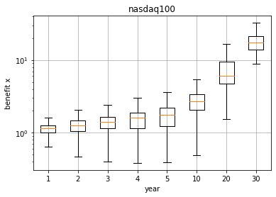
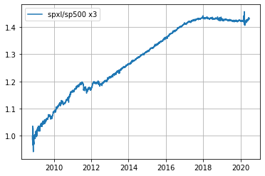
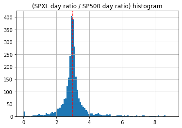

実は株より安全で利回りが良い!レバレッジETFを統計的に検証してみた結果

# 超短い結論
レバレッジ・インデックスETFは用法用量を守ればオリジナルよりも安全かつ高収益資産！

# はじめに
僕が投資先を選定する上でレバレッジ・インデックスETF（以後レバレッジETF）に出会い。この記事はレバレッジETFが危険と言われるのはどうしても信じられなかったので自分で検証した記事です。

僕は俗にあるレバレッジETFの特性は勘違いによって生まれていると思います。そこで、この記事を通してレバレッジETFの強みと弱みを”統計的”な側面から客観的に見ていただきたいという思いを込めて書いています。ぜひ、この機会にレバレッジETFの世界を一緒に眺めて見ませんか？きっと面白く思えるはずです。ただし、

*あくまで投資は自己判断で。*

申し訳ありませんが、僕は皆様のお金に責任は持てませんのでご注意ください。信じるも信じないも皆様次第です。

では、サッソク見て行きましょう！！！

# 背景
昨今の暴落もあり投資が注目を集めてる気がします。しかし、個別株はかなり知識がないと厳しそうです。非証券マンなエンジニアにはそれはきつい。
そこで、何か、簡単に投資できて利回りが良いもの追い求めた結果たどり着いたのが「レバレッジETF」です。
レバレッジETFとは、何か参考となる株価に対してレバレッジ、つまり倍率をかけた株価になるように動く証券です。例えば、日経225の2倍レバレッジETFは日経225の株価の2倍の株価に連動して動きます。

要は、100万円日経225に投資する代わりに2倍レバレッジETFに投資すれば200万円日経225に投資したのと同じような効果を得られるということです。ただし、借金して100万円を200万円にしてるわけじゃないので、仮に日経225が0円になってもレバレッジETFに投資した100万円が0円になるだけで、借金をこさえる心配はありません。

ここだけ聞くと青天井が2倍で下が同じに見えるので最高の証券にも見えるのですが、そんな甘い話じゃないんですね。レバレッジETFには様々な人が様々な立場で話しています。

以下に立場別にいくつかリンクをご紹介します。


- 否定
    -  [マネーの手帳　レバレッジ型ETFの投資で知っておくべき特徴やリスクをまとめました](https://www.crowdport.jp/money-notebook/833/#:~:text=%E3%83%AC%E3%83%90%E3%83%AC%E3%83%83%E3%82%B8%E5%9E%8BETF%E3%81%A8%E3%81%AF%E3%80%81%E6%9D%B1%E8%A8%BC1%E9%83%A8%E3%81%AB%E4%B8%8A%E5%A0%B4,%E3%81%99%E3%82%8B%E4%B8%8A%E5%A0%B4%E6%8A%95%E8%B3%87%E4%BF%A1%E8%A8%97%E3%81%A7%E3%81%99%E3%80%82)
    - [高橋ダン様 【騙されるな】買ってはいけない金融商品？](https://www.youtube.com/watch?v=ecxP6wCQrQg)
    - [両学長　第40回 お手軽に莫大な利益を得る方法。レバレッジETFはアリか？【お金の勉強 株式投資編】](https://youtu.be/oRei15CZG14)
- 肯定
    - [rokohouse様 超低リスクで2億円を手にするレバレッジETFによる超長期投資法とは？](http://www.rokohouse.net/archives/2312)


>### リンク先記事補足
>否定派はyoutubeの動画が2件になってしまいました。普通のWEB記事にも多かった印象があるんですが、探そうと思うと見つからないもんです。もう1つのサイトもじゃっかん否定的ですが中立的です。どれも指数からの乖離などを説明する典型的な説明をなさっていると思います。
> 一応言っておくと、両学長さんもダン高橋さんも非常に知己に富んだ情報を発信してくれる方々です。発信者としては両名ともにおすすめできる方です。お二方の動画を上げたのは僕が見て記憶に新しかっただけです。
> 肯定派に上げたrokohouseさんの記事もどれも良記事です。ぼくと同じで統計的な性質に重きを置くエンジニアの方のようです。実は今書いている記事を書くまで存じ上げなかったのですが、周辺調査をする最中に発見し大体読ませていただきました。正直、rokohouseさんの記事読んでいれば、このQiitaの記事はそこまで差はないと思います。一応差分を作ったつもりではありますが。

僕はレバレッジETFについては肯定派よりだと思います。なぜなら、否定派の説明は数学的に考えて理屈に合わないと思うからです。では、その理屈と僕の納得が行かない理由を見ていきます。

## 否定派の理由
### レバレッジETFは日々の株価の動きにレバレッジをかけているので指数から乖離する
レバレッジの投資商品はいくつもあり、有名所だとFXが上げられると思いますが、レバレッジETFはFXと大きくことなるのが*前日比*に対してレバレッジをかけていることです。
この仕組の直感的でない(?)ところが原因で、例えば

> 10年でSP500の株価が100%増加した => SP500のレバレッジ3倍ETFは300%増加した

は成り立ちません。「おいおい日経225の2倍で動くとかさっき自分で説明してたじゃん」と思った方。鋭いです。しかし、「あれは嘘だ」。ただ、同時に近似的には正解なんです。厳密には違うというだけ。

細かいことを言えば、レバレッジETFの増加分は元となる株価の倍数よりも小さかったり大きかったりするのです。
もう一度になりますが、それは、レバレッジETFの価格は元となる株価の1日よりも長い時間に対する価格変動に単純に倍数をかけただけの動きを保証しないからです。

しかし、本当に問題になるほど乖離するのでしょうか？

では株価変動の様子を実例で見ていきましょう。

例えば、2012/4/2-2020/4/2の動きで、SP500[^1]”先物”[^2]は1.81倍に、対してSP500の3倍レバレッジETFであるSPXLは3.47倍です。単純な計算であれば 1+0.81*3 = 3.43倍なので、少し単純計算よりも儲けが多いです。 しかし、まぁ誤差の範囲内でしょう。

[^1]: SP500はアメリカの株式の代表的な株価指数です。最近はこれを買っておけって意見がほとんどですね。
[^2]: あえて”先物”と書きましたが、SPXLは先物の3倍の値動きを目指すものなので先物を指標に使いました。ただ、先物も現物もめちゃくちゃ値動きが異なるということはないので先物でも現物でも大した差はないです。現物は例示の機関で1.74倍になってました。

このように確かにレバレッジETFは日々の価格に対して”しか”レバレッジをかけていませんが、それってあまり問題ではないんですね。

Qiitaらしく数学的な話をするならこれは高校でならう近似式のお話そのもです。 $r_i << 1$である$r_i$について次の近似式が成り立ちます。

```math
\prod_{i=1}^{N} (1+r_i) \simeq 1 + \sum_{i=1}^{N} r_i
```

この式が示すのは、「1%上昇、1.5%上昇、0.5%下降した価格はおおよそ2%(=1+1.5-0.5)上昇になるよ」という至って直感的な話です。

つまり、価格変動が1よりも十分に小さいといえる範囲（数％）ならばその変動率を足し算した変化率が全体の変化率とほぼ言えるのです。SP500などの指数は暴落時などを除けば1%以内の動きで収まります。となれば、この近似式が成り立つので長期で見てもそこまで乖離することはないのですね。

まとめると、日々の価格変動にしかレバレッジをかけていないからと行って全体の指数がハチャメチャになるかというとそんなことはなくないということです。近似的には全体でもレバレッジをかけた株価になってくれます。

### レンジ相場に弱い

レンジ相場とは上げて戻して上げて戻してとジグザグして全体としては上昇も下降もしない相場のことを言います。

仮にレバレッジETFが元とする指数が「-5%, +5%, -5%, +5%」と動くときは3倍のレバレッジETFは「-15%, +15%, -15%, +15%」となります。両方の最終的な株価の変動率を計算してみると

```math
origin:          0.95 \times 1.05 \times 0.95 \times 1.05 = 0.995
3倍レバレッジETF: 0.85 \times 1.15 \times 0.85 \times 1.15 = 0.956 
```

とこのように、レンジ相場にも関わらずレバレッジETFの方がより下落幅が大きくなるので、多くの場合、この減少を「レバレッジETFの原価効果」といい、「レバレッジETFはレンジ相場に弱い」と言われています。

たしかに3倍レバレッジETFの方が下がりが大きいし、それは3倍どころではありません。

ここでも数式のモデルを使って見ましょう。レンジ相場を$r$と$-r$の変化率の繰り返しと定義し、$2N$日後の株価を考えるものとします。このとき$r^3 << 1$で無視できるものとします。すると、以下の近似式が成り立つのです。

```math
2N日後の価格の比 = (1+r)^N (1-r)^N = 1 - Nr^2
```

さきほどの例で言えば\$r = 5%\$なので　\$2 \times 0.05^2 = 0.005\$と下落幅ピタリですね。では、レバレッジETFはどうかというと、この変動率\$r\$にレバレッジLをかけるだけなので

```math
2N日後のレバレッジETFの価格の比 = (1+Lr)^N (1-Lr)^N = 1 - N(Lr)^2
```

単純ですね。ただし、$L$の2乗で効いてくるのがポイントです。先程の例で言うなら、$2 \times (3 \times 0.05)^2 = 0.045$です。下落幅は3倍じゃなくて、9倍だったんですね！。

というように、レンジ相場での下落幅はレバレッジの2乗で効くことがわかりました。恐ろしいですねー。

ただし、思いおこしてほしいのが、$r^2$ってそもそも小さくないか？ということです。
今回は5%の例を上げましたが、日々の動きが5%の指数って結構荒れてます。普通は1％くらいです。
つまり$r^2$自体が結構無視できる程度の変化率なのかなと思います。1万分の1ですからね。

ただし、暴落時のV時回復は別です。今回のコロナ暴落もそうですが、値動きが激しいレンジは$r^2$の効果がでるでしょう。実際、今回のコロナ暴落で米国株はほぼ元の価格に2020/6/27現在で戻っていますが、レバレッジETFはその限りではありません(SP500は2月のピークから-10%程度、対して、3倍レバレッジETFのSPXLは-47%)。この点は注意が必要です。ただ、3月からここまで120日程度あるので、$Nr^2 = 0.1$となり、$9* Nr^2 = 0.9$のはずですが、そこまでの下落ではないので、モデルが単純過ぎた結果なのかモデルほどの酷さはないようです。そもそも、毎日同じ変動率なのは変ですからね。そういうところから来る誤差だと思います。

この項でお伝えしたかったのは、一般に言うレバレッジETFの原価効果は何もレバレッジETFにのみに存在する効果ではなく、レバレッジによって増強される程度は高々$(Lr)^2$であるということです。$r$が小さければほとんど問題になりません。

## 肯定できる理由
### 期待値を上げる効果が期待できる
そもそもSP500などに投資する目的って多くが「長期投資すれば”必ず”儲かる」からなんです。このあとちゃんと検証もしますが、たしかにSP500は長期間持つことでほとんど損失することなく利益を得ることができます。

ここで少し話を変えてみましょう。

例えば、ここにお金を入れると必ず2倍に増えてお金がでる装置があったとします。この装置は3回だけ使えるとしましょう。そんな装置があったら、どうします？

僕ならこうします。まず銀行に行ってこの装置の説明をします。そこからありとあらゆる自分の資産を担保に極限までお金を借りて、そのお金を装置に入れます。出てきたお金はもう一度通します。また、もう一度通します。こうすることで例えば、1億円借りられれば大体7億円利益が得られます。やべー。今手元にあるお金が100万円しかなければ、利益は700万円ですから、その差は圧倒的です。

つまりです。必ず儲かる仕組みがあるなら借金をしてでもやるべきなんです。

話を戻します。

SP500に投資するときは「長期投資すれば”必ず”儲かる」から投資するのでした。ここでいう長期投資はよく言うのは20年くらい。この長期投資ができる回数って大体の人にとって3回くらいですかね。

そうです。本質的には先程の装置の例えとそこまで変わりません。お金を入れてからでるまで20年かかるだけです。（そこが1番の問題ですが）

なので、借金をしてでも投資する、レバレッジETFにはそういう意味で合理性があるといえると思います。

ただ、ここまでは定性的な話でした。数式でも見ていきましょう。

#### 数式で検証してみる

ある証券Aの20年後に得られる価格変動率を確率変数$R$とします。　では、そのAの$L$倍のレバレッジETFについてその平均値と分散を考えて見ましょう。しかし、これは簡単ですね。

```math
レバレッジETFの平均値 = L \times E[R]
レバレッジETFの分散 = L^2 \times VAR[R]
```

つまり、レバレッジETFは得られる期待値を$L$倍して分散は$L^2$します。例えば、必ず儲かるマシンの話なら$VAR[R]$はそもそも0なので、期待値を上げる効果だけが作用してお得だった訳です。

しかし、実際の長期投資はそういうわけではありません。期待値を上回る利益の方向にも逆に下回る方向にも分散があります。問題になるのは、もちろん下回る方向の分散です。上回ってくれる分には何も文句がありませんからね。

しかし、こればっかりは何もフォローの仕様がありません。調べてわかったことでもありますが、きちんと損する可能性が生まれてしまうくらいには下方向の分散を大きくしています。SP500に投資している分には必ず儲かるのに、その*レバレッジETFでは、無価値化する場合が出始める程度には危険度が増します*。

無価値化するというのは想像異常に危険で、半値程度ならそのあと倍以上に上がってくれれば這い上がれるのですが、本当に0になってしまうと何をかけても0なので救いようがないわけです。実はこれを救う方法もあるのですが、あとに書きますね。

危険度の話ばかりフォーカスしましたが、利益の面で強調したいのは*期待値や中央値という尺度では明らかにレバレッジを効かせた方が良い利益をもたらす*こともわかりました。しっかり式通りの性質があるのですね。

しかも、無価値化すると怖いことを書きましたが、その確率は1%とかそこらです。十分すぎるくらい大きいと個人的には思いますが、繰り返しますが、期待値や中央値はきちんと良くなってます。

実際のところ、否定派の理由として使うなら「無価値化する確率が少なからずあること」ここを十分に指摘するべきだと僕は思います。自分が100個の独立な世界線を生きれる量子的な存在ならいいですけど、そんなんじゃないですからねｗ。1%の確率でも分だら死ぬならやりたくないわけです。

# 検証

さぁ、なが～いプロローグでしたが、やっと本題の検証です。以上の事前検証からわかるのはレバレッジETFのリスクとメリットを定量的に測ること。これを歴史的なデータから定量的にやることだと考えました。

考察するにあたりある程度前提をご紹介します。

## 対象
- [SP500](https://finance.yahoo.com/quote/%5EGSPC/history?p=%5EGSPC)
    - 米国の代表的な大型株500社の平均値。米国市場にまんべんなく投資しできる
- [NASDAQ100](https://finance.yahoo.com/quote/%5EIXIC/history?p=%5EIXIC)
    - ナスダックに上場する時価総額上位100社の平均。IT系が多くあり、GAFAなどがその例

どちらも個人的に好きな指数です。おそらく多くの人が知っていて投資したい指数だと思います。
SP500に関しては92年分のデータが手に入ったのでかなり良い統計量が与えられそうです。(大恐慌時の株価も検証に入ります)データのソースはリンクとして貼っておきました。

また、レバレッジETFとして各々の指数の3倍レバレッジETFを想定します。これは実際に存在するSPXLとTQQQに相当します。しかし、SPXLとTQQQはリーマンショック以降に誕生した証券でそれ以前の価格を参照することができず、リーマンショック以降は明らかな株高だったのでレバレッジETFに有利な方向に統計的に偏ります。

そこで、本記事の検証ではSPXLやTQQQのデータはあえて用いずにSP500とNASDAQ100の指数のみから3倍レバレッジETFをシミュレートすることでその代わりをさせることとします。

このとき、シミュレーションの方法はそれぞれの指数の終値前日比に対して3倍を掛けて得られた3倍前日比から累積積を取ることで計算しました。

## もしリーマンショック以前にレバレッジETFがあったら

検証の前に株価がどう推移したのかをレバレッジETFと元の指数を並べて見てみましょう。

|  SP500  |  NASDAQ100 |
| :-: | :-: |
|   |     |

どちらのデータも始まりの日を価格１として計算し、株価を対数にした片対数グラフにしました。

まず意外だったのは、レバレッジETFは前日比を３倍するという仕組み上元とする指数の前日比が-33%を超えると-100%の下落となり無価値化してしまうとおもったのですが、今回の検証の範囲ではそういう日は一度もなかったようです。

とはいえ、SP500の大恐慌時の暴落はひどかったようで、一時は1/1000にまで価格が下落しています。ほぼ無価値化してますね。
ただ、その後はSP500のレバレッジETFはリーマンショックなどの暴落の影響を受けて1/10の価格になるなどを経験しつつも大方順調に価格を伸ばています。

NASDAQ100の方は大恐慌のときの株価がなかったため、主に.comバブルの影響が強い印象です。.comバブルとリーマンショックを合わせれば価格が1/500程度に下がっています。

このように、レバレッジETFは暴落時に価格をほぼ無価値にしてしまう危険性がつきものだということがわかりました。つまり、暴落手前まで伸ばしてきた資産を暴落でほぼ0にしてしまうのです。これじゃ、いくら利回りが良くてもいつかは破綻します。

しかし、同時に無価値化したあとも元の指数と並びかつ超えることができる程に暴落後の伸びも著しいものがあります。
つまり、やはり利回り自体はいいけれど、いつかは紙くずになる。それがレバレッジETFです。

## 今買ったETFはn年後どうなってる？

nには1,2,4,5,10,20,30を使いました。
検証方法はまずランダムに投資開始日を決定して、
そこからちょうどn年後の価格の価格を見て何倍になったかを1万回サンプリングすることによって検証しました。
この検証によって、今日買った証券がn年後、何倍になっているかを予想することができます。


その結果は次の箱ひげ図のようになりました。

|レバレッジ/指数| SP500 | NASDAQ100 |
| :-: | :-: | :-: |
|レバレッジなし|  |  |
|レバレッジあり| | |

詳しい結果の表は、紙面上の問題で[ここ](#今買ったETFはn年後どうなってる？データ編)に置きました。
具体的な数字にも言及するので適宜こちらも参照ください。
画面広い方はこのページ2枚開いて片方は表を開いてくだされば読みやすいと思います。

とりあえず箱ひげ図を見ると、
レバレッジなしの指数はきれいに時間が経つごとに利益が伸びる性質があるのがわかります。
美しさすら感じます。
面白いの最小値の動きで、年月を大きくすると最初は小さくなりますが、
4年を超えると大きくなります。こんな性質は初めて聞きました。
レバレッジETFはどの年も最小値はほぼ０なので差は感じないですね。
上値や中央値は年月に比例して大きくなってますが、当たり前で面白くはないです。

では、細かい数字も見ていきましょう。
まずはレバレッジETFでない方から

まずSP500もNASDAQ100も安全資産とは言えなさそうだということがわかります。
例えば、SP500は投資期間が20年を超えるまでは1%分位点で半値程度に価格を落としています。
面白いのは、「長期投資すれば”必ず”儲かる」とか先述しましたが、これはほとんどの場合で成り立ちますが、
この結果を見る限り、20年長期保有してもわずか数％ではありますが、元本割れを起こす時期もあったようです。
（おそらく大恐慌）

また、SP500とNASDAQ100を比較すると、NASDAQ100の方が利回りがいいですね。
さらに、損失面でも1年目や2年目はNASDAQ100の方が大きくなりますが、
3年を超えると損失すらも小さくなっています。
最近のIT分野の勢いが味方して、SP500とNASDAQ100の比較では、NASDAQ100の方に軍配が上がりそうです。

では、レバレッジETFはどうでしょうか。

まず、レバレッジETFは、NASDAQ100の20年と30年の投資を除いて、
どのn年後をみても数％になるリスクすなわち、無価値化するリスクを抱えていることがわかります。
nasdaq100の30年後だけ下位1%でも7倍になっていますが、NASDAQ100のデータが50年ほどしかなく、
30年のスパンを見れば.comバブル直前での買いをせずに済むからだと考えられます。
レバレッジETFへ投資するときはこの無価値化リスクを常に考慮する必要がありそうです。

ただし、利益の面でも注目が必要です。
元の指数とレバレッジETFの1年後の中央値を比較すれば、
SP500では9.0%と21.8%で2.5倍程度、NASDAQ100では14.0%と39.6%で、
レバレッジETFの方が利益も大きいことは明らかです。

もっとも夢のある見方をすれば、NISAの投資期間である5年を見ると、
NASDAQ100のレバレッジETFは上位10%で12倍に価格を伸ばしています。
NASDAQ100自体の上位10%が2.5倍であることを踏まえると
その利益はレバレッジを効かせた3倍どころでない利益だとわかります。
NISAの投資枠は年間120万円ですから、120万円投資したとすると、
1400万円を得ることができたという訳です。すごすぎ

また、期待値を見ると、レバレッジETFの方が元の指数に比べて3倍以上の利回りがあることが改めてわかります。

また、それぞれの証券について期待値を見ても同様にレバレッジETFが3倍よりも良い成果をあげていることがわかります。しかし、期待値については上振れの外れ値の影響を強く受ける性質があるので注意が必要です。

ただ、これ見て気づいたのですが、どこかで20年以上SP500を持っていれば損した年はなかったっていうのを聞いた記憶があったんですが、損する日はどこかにはあるみたいですね。5%よりは低い確率みたいですが。おそらく大恐慌あたりでしょうね。

# 考察
## レバレッジETFの危険性は無価値化にある
無価値化はSP500やNASDAQ100に投資しているならばおよそ想定する必要のない危険性です。
無価値化すると、追加投資なしにはその資金が取り返せません。
なので、無価値化はかなり危険です。その危険性がレバレッジETFにはあります。

本記事の検証では、92年間の歴史上では真に0ドルになる無価値化が起こらなかったことがわかりましたが、1000万円が1万円になるとか数十万円になる危険性はことがわかりました。

今回は証券のなかでは比較的安定している指数であるSP500とNASDAQ100のレバレッジETFの結果だけを見ましたが、より動きの激しい指数や株のレバレッジETFはその危険性が高まるのは言うまでもありません。

一例をあげれば、原油の指数のレバレッジETN（ほぼETFと同義）が無価値化したことがつい最近ありました。[Bloombergの記事](https://www.bloomberg.co.jp/news/articles/2020-04-22/Q9764VDWLU6T01)

SP500やNASDAQ100のレバレッジETFがいつこうなるかとは誰も予想できません。レバレッジETFに投資する際は明日にも無価値化する危険性が常にあるということだけは抑える必要があるかと思います。

## レバレッジETFは買うな？
「無価値化する危険性があるからレバレッジETFを買うな」というわけではありません。
心づもりを持つ必要があるのと、それを知った上で正しい運用をすべきです。
では具体的にどんな運用かと言うと、すべての投資資産をレバレッジETFで持たなければよいのです。

まず、検証してきた通りレバレッジETFの利回りは確実に元の指数よりも高いです。この良い性質を自分のポートフォリオに生かさない手はないと僕は考えます。

ここで50%の確率で10倍、50%の確率で0倍のお金を返却するスロットがあったとしましょう。
すぐわかるように、このマシンの期待値は5倍なので、回せば回すほど得しそうです。
こんなうまい話は実際にはないでしょう。
では、掛け金をすべてこのマシンに投下し、得られた利益もすべてこのマシンにかけることを繰り返しましょう。
そうすれば利益を最大化できるはずです…。

しかし、これをやってみると、どこかで必ず資産がなくなります。
無限回の試行を行えば必ず0倍の場合を経験するはずだからです。

この例はかなりシンプルな例ですが、レバレッジETFの危険性を理解するのに有効です。
おわかりの通り、このマシンはレバレッジETFの比喩です。1試行が1年間の運用とでも考えると良いと思います。
しかし、ここで終わりではありません。
では、このマシンに投下する資金はかならず現状の資金の1割だとした場合はどうでしょうか？
これなら、仮に0倍で帰って来ても1割の損失で済ませることができます。

では、実験しましょう。
スロットを20回試行するとして、毎度資金の1割だけをスロットに投下します。スロットから得られた利益は資金に追加することとします。この一連の試行を1万回試し、資金の最終的な利回りを見てましょう。
その結果はつぎの図のようになります。


結果、下位1%の利回りが5倍、元本割れリスク0.0005%、利回り中央値851倍、利回り期待値214倍となりました。

どうでしょうか？リスクをほぼなくし、利益はしっかりあるのがわかると思います。

実際にはこんな上手いスロットマシーンあるわけないのですし、
そもそも、期待値5倍なので$5^20=9 \times 10^12$が狙えるはずなんてことを考えると利益もしょぼく見えます。
(ただし、1割しか投資しないことを考慮すると利益が1/10なので、
$1.4^20=837$と中央値の値に近いので平均的な利益を取れていることがわかります。)

このように一部を投資に回す資産を保全するやり方は投資の世界では古くから行われる
アセットアロケーションとか資産配分と言われる行為そのものです。

投資的に言うなら「スロットマシーン1割、現金9割の資産配分を行い、毎試行ごとにリバランスした」となります。

資産配分とかリバランスとか、それっぽいこと言ってますが、要はさっきの投資法のことです。

つまり、リスクの高い投資手法にすべてを投資するのではなく、
分散して投資しようという当たり前な話なのです。

## 資産配分は逆レバレッジ？

この資産配分の話を見るとこれは逆レバレッジではないかと考える方がいらっしゃると思います。
つまり、10投資できたものを5で抑えるのなら0.5倍のレバレッジを証券に掛けたと考えることができるからです。
この捉え方は何も誤りはありません。全くのそのとおりです。

なら、3倍レバレッジETFを0.5のレバレッジ掛けたり、ましては1/3のレバレッジを掛けては、せっかくのレバレッジETFの意味がないじゃないか。

そう思いますよね。

次の項ではそんな疑問を解決しつつ、衝撃の事実を明らかにします。

# 実はインデックスよりも安全だったレバレッジETF

ここでは新たに毎年リバランスを行った場合のシミュレーションをしてみます。

資産配分には
- 証券を全資産の1/3に保つ場合:パターン1
- 証券を全資産の半分に保つ場合:パターン2

の2つのパターンを試しました。
パターン1のレバレッジETFは実質元のインデックスに全資産を投資するのと等価なはずなので
そこを意識して結果を見てましょう。

それではサッソク結果を見てみましょう。

こちらもデータが多いので結果は[こちら](#実はインデックスよりも安全だったレバレッジETFデータ編)に別掲しました。

パターン2は資金の半分なのでレバレッジETFを使った場合は実質1.5倍レバレッジETFになります。
対して、パターン1ではレバレッジETFを使った場合は実質レバレッジが1倍。
つまり、元となる指数の証券を100%の割合で保持するのと同等です。

では、それぞれのパターンについて見ていきましょう。

まず注目すべきはパターン1のレバレッジETFと元となる指数を100%の割合で投資したときの比較でしょう。
言わずもがなですが、後者のデータはすでに[前項](#今買ったETFはn年後どうなってる？)で検証済みですからそこから持ってきます。紙面と長期投資に注目する都合10年と20年の利回りについて考えます。

| sp500 レバレッジETF 1/3投資 |期待値|  1%  |  5%  | 10%  | 15%  | 20%  | 25%  | 50% | 75%  | 80%  | 85%  | 90%  | 95%  | 99%  |
|------------|-----:|-----:|-----:|-----:|-----:|-----:|-----:|----:|-----:|-----:|-----:|-----:|-----:|-----:|
|10y_sp500_x3| 2.201|0.5401|0.8054|0.9923|1.1118|1.2218|1.3478|2.066| 2.888| 3.094| 3.320| 3.608| 4.197| 4.802|
|20y_sp500_x3| 4.992|0.7387|1.7284|2.1186|2.3553|2.5793|2.7674|4.359| 6.458| 7.147| 7.908| 8.680|10.714|14.841|

| sp500 100%投資 |期待値|  1%  |  5%  | 10%  | 15%  | 20%  | 25%  | 50% | 75%  | 80%  | 85%  | 90%  | 95%  | 99%  |
|---------|-----:|-----:|-----:|-----:|-----:|-----:|-----:|----:|-----:|-----:|-----:|-----:|-----:|-----:|
|10y_sp500| 2.060|0.4386|0.6948|0.9467|1.0669|1.1958|1.3045|1.963| 2.801| 2.891| 3.003| 3.174| 3.738| 4.335|
|20y_sp500| 4.407|0.5957|1.5795|1.9868|2.1779|2.2993|2.5176|3.861| 5.868| 6.318| 6.605| 7.055| 9.620|12.952|

| nasdaq100 レバレッジETF 1/3投資 |期待値|  1%   |  5%   |  10%  |  15%  |  20%  |  25%  | 50%  | 75%  | 80%  | 85%  | 90%  | 95%  | 99%  |
|----------------|-----:|------:|------:|------:|------:|------:|------:|-----:|-----:|-----:|-----:|-----:|-----:|-----:|
|10y_nasdaq100_x3| 3.830| 0.7084| 1.1459| 1.6277| 1.9037| 2.1307| 2.3540| 3.407| 4.822| 5.176| 5.596| 6.234| 7.822| 12.346|
|20y_nasdaq100_x3|13.927| 2.7730| 3.8355| 4.9315| 5.6681| 6.3718| 7.0286|11.066|18.403|20.679|23.026|27.137|33.082| 46.433|

| nasdaq100 100%投資 |期待値|  1%  |  5%  | 10% | 15% | 20% | 25% | 50% | 75% | 80%  | 85%  | 90%  | 95%  | 99%  |
|-------------|-----:|-----:|------:|------:|------:|------:|-----:|-----:|-----:|-----:|-----:|-----:|-----:|-----:|
|10y_nasdaq100| 2.917|0.5665| 0.7944| 1.3786| 1.7100| 1.9132| 2.072| 2.690| 3.404| 3.685| 4.057| 4.466| 5.592| 9.468|
|20y_nasdaq100| 8.012|2.4078| 3.4372| 4.1804| 4.3966| 4.5713| 4.775| 6.099| 9.579|11.848|13.357|15.047|18.646|26.270|

この結果には、一瞬目を疑いました。
レバレッジETFは3倍のレバレッジをかけると言っても
実際にはちょいしたくらいの利回りしか得られないんだろうなーって勝手に思ってたんですが、
実際には*いかなる条件でレバレッジETFで1/3の配分で投資する場合が上回っています*。

これ簡単に言ってますが、すごいことです。

いかなる投資家はsp500の代わりにその1/3の資産でspxlを買えって言ってるわけですから。
世間の常識からははずれた意見だと思います。
しかも、ぼくの気まぐれで言っているのではなく、データを検証していたら出てきた統計です。

たしかに、検証が誤っている可能性は否定しません。
そのために、検証に使ったコードは[github](https://github.com/IntenF/leveraged_etf)で公開します。
検証自体を校閲してくださる方はぜひご覧いただければと思います。

検証自体の検証として実際の3倍レバレッジETFであるSPXLと比較を行い、乖離していることを認めましたが、今回の検証で用いているレバレッジETFを使う方が利回りが少なく見積もられていたのでプラス方向のバイアスはないかなと思っています。

では、なぜこのような現象が起きたのか理由らしい理由がほしいものです。

ここからは検証したのではなく、あくまで想像、意見の範疇の話ですが

1. レバレッジETFの順張り特性が功を奏した
2. 損失が2/3に抑えられ、リーマンショック級の大幅下落を耐えやすかった

1.について、これはROKOHOUSEさんがその記事である
「[レバレッジETFは、本質的には逆ドルコスト平均法である](http://www.rokohouse.net/archives/1439)」
で指摘されていた点からの推測です。
レバレッジETFが何故順張りと等価なのかはROKOHOUSEさんの記事を読んで頂くとして、
レバレッジETFには単純に3倍投資を行うこと以外に実は毎日価格変動に対して
順張りしているのと同じことが起こっています。
この順張り性質がSP500などの指数にうまく働き利益を上乗せできた可能性があります。

2.について、リーマンショックなどの金融危機は資産を目減りさせる大きなイベントで、
この目減りを極力さけることができれば逆に危機のあとの高利回りの時期を美味しく過ごすことができます。
レバレッジETFの資産を1/3に抑えたことで、少なくとも株の損失を1/3に抑えつつ、
リバランスをすることで暴落からの上がりを得られたのだと思います。

とはいえ、1/3の割合で投資してしまうと、やはり利回り自体は悪くなります。
ここまで安牌でなくて良いならパターン2の半分を証券にする戦略があります。

| sp500レバレッジETF  1/2投資 |期待値|  1%  |  5%  |  10%  |  15%  |  20%  |  25%  | 50%  | 75%  | 80%  | 85%  | 90%  | 95%  | 99%  |
|------------|-----:|-----:|-----:|------:|------:|------:|------:|-----:|-----:|-----:|-----:|-----:|-----:|-----:|
|10y_sp500_x3| 3.073|0.2930|0.5618| 0.8529| 1.0290| 1.1862| 1.3869| 2.650| 4.273| 4.658| 5.204| 5.785| 7.259| 9.111|
|20y_sp500_x3| 9.675|0.4396|1.8110| 2.5628| 3.0325| 3.4099| 3.7487| 6.731|13.160|15.292|17.581|19.906|25.830|41.197|

| nasdaqレバレッジETF 1/2投資 |期待値 |  1%   |  5%   |  10%  |  15%  |  20%  |  25%  |  50%  |  75%  |  80%  |  85%  |  90%  |  95%  |  99%  |
|----------------|------:|------:|------:|------:|------:|------:|------:|------:|------:|------:|------:|------:|------:|------:|
|10y_nasdaq100_x3|  6.414| 0.4693| 0.9102| 1.6903| 2.1885| 2.5840| 2.9451|  5.102|  8.125|  9.012| 10.005| 11.950| 16.229| 31.454|
|20y_nasdaq100_x3| 37.045| 3.2921| 5.4496| 7.4397| 9.1093|10.5072|11.8788| 21.893| 46.582| 59.136| 71.306| 88.943|116.855|179.905|

この方針だとパターン1に比べてさらに利回りが狙えているのがわかるでしょう。
特にnasdaq100レバレッジETFへ投資したときの利回りは下位20%でも20年後には10倍になっています。
今の100万円は20年後の1000万円だと思って使った方がいいかもしれませんね（笑）。
しかも下の方の確率に目を当てても下位1%で3.2倍は驚くべき数値です。
ただし、sp500のレバレッジETFは下位1%が0.41倍なので、
大恐慌などがデータに含まれていなかっただけである可能性は否めません。
しかし、半値に落ちても良い程度のリスクを許容できるなら、この利回りを狙ってみるのも良いでしょう。

# まとめ

## 用法用量を守って正しくレバレッジETFを使いましょう
レバレッジETFの真実を明らかにするために、本記事は市場のデータ92年分からレバレッジETFの性質を考察してみました。

その結果わかったことは次のようにまとめられます。

1. レバレッジETFの利回りは中央値、期待値の良い利回り。3倍以上も狙える
2. レバレッジETFは無価値化する危険性がある

無価値化する危険性を少なくしつつ、利回りが良い性質を活かす方法として資産配分を減らすことも検証してみました。

その結果は、

1. 無価値化する危険性は排除できた
2. 全資産の1/3だけレバレッジETF持った場合、元の指数の利回りを1~99%分位点ですべて上回った
3. 全資産の1/2だけNASDAQ100レバレッジETFを持つと20年利回り10倍が下位20%の利回り

となり、リスクを抑えつつ、ほとんどの確率で利益を確保することに成功しました。

特筆すべきことは2.の性質で今回の検証の中では元のインデックスを持つくらいなら、1/3の資産だけ3倍レバレッジETFに置き換え、残りを現金などの安全資産で持ったほうが利回りが良いことがわかりました。
原因は探っていませんが、レバレッジETFの順張り特性と安全資産を持つことによる損失の最大値を抑える効果が効いたと推測しました。

今所有しようと思っている現物の株式をレバレッジETFで
少なめに持つことは意外にも、むしろ安全だったというお話でした。

# 最後に: 投資は自己判断で

ただ、ここまで言いましたが、申し訳ありませんが僕は読者の方々の投資に責任は持てません。
なので、こう言わざるを得ないのです。

*投資は自己判断で* 

長文お読みくださり、ありがとうございました！

# おまけ　データとか検証

## 検証の検証

検証するにあたって検証に使うデータが誤りでないかを検証したいと思います。

題材は、SP500の3倍レバレッジETFです。
これについて、SP500の日々の価格に3倍を掛けて生成した検証用のデータsp500 x3と
実際に売買されている3倍レバレッジETFSPXLを比較します。

結果は以下のようになりました。


ほぼ同じでしょうか？

SPXLがリーマンショック辺りに生まれた証券なので、金融緩和以降の経済の影響に偏った結果
ではありますが、まぁよいのかな？という感じです。

次の図はSPXLをsp500 x3で割った値のグラフです。



上昇局面ではSPXLがより高くなり、下降局面ではSPXLがより安くなるという感じですかね？
つまり、SPXLの方が若干値動きが激しそうです。

株価は基本上昇局面の方が長いのでズレは検証用データよりもSPXLが上回る方向にいくはずです。

利回りが多いに越したことはないので、まぁ良いと思いました。

気になったのでSPXLの前日比がSP500の前日比に対してどう動いているか見てみると
そのヒストグラムは次のようになりました。



大体3の辺りに集中していますが、2~4倍くらいまでは広く分布してそうです。

完璧ではありませんが、検証自体はできそうといった具合でしょうか？

## 今買ったETFはn年後どうなってる？データ編

それぞれ数字はn年後に何倍の価格になったかを表しており、行は期待値と分位点を表しています。
例えば、行50%の列10y_nasdaq100_x3の値は
NASDAQ100の3倍レバレッジETFの株価が10年後に取りうる価格の中央値を表しています。

### sp500
|         |期待値|  1%  |  5%  | 10%  | 15%  | 20%  | 25%  | 50% | 75%  | 80%  | 85%  | 90%  | 95%  | 99%  |
|---------|-----:|-----:|-----:|-----:|-----:|-----:|-----:|----:|-----:|-----:|-----:|-----:|-----:|-----:|
|1y_sp500 | 1.078|0.5638|0.7509|0.8356|0.8804|0.9278|0.9643|1.090| 1.199| 1.227| 1.260| 1.301| 1.375| 1.538|
|2y_sp500 | 1.153|0.3674|0.6568|0.7834|0.8717|0.9527|1.0058|1.158| 1.325| 1.366| 1.427| 1.498| 1.606| 1.832|
|3y_sp500 | 1.235|0.3026|0.6700|0.7734|0.8724|0.9750|1.0355|1.246| 1.431| 1.481| 1.544| 1.648| 1.860| 2.097|
|4y_sp500 | 1.331|0.3514|0.6658|0.8106|0.8874|0.9588|1.0384|1.319| 1.577| 1.631| 1.712| 1.832| 2.067| 2.577|
|5y_sp500 | 1.435|0.3931|0.6934|0.8572|0.9257|0.9863|1.0662|1.432| 1.718| 1.789| 1.893| 2.073| 2.271| 2.871|
|10y_sp500| 2.060|0.4386|0.6948|0.9467|1.0669|1.1958|1.3045|1.963| 2.801| 2.891| 3.003| 3.174| 3.738| 4.335|
|20y_sp500| 4.407|0.5957|1.5795|1.9868|2.1779|2.2993|2.5176|3.861| 5.868| 6.318| 6.605| 7.055| 9.620|12.952|
|30y_sp500| 8.387|2.2489|3.8320|5.1281|5.5091|5.7516|5.9714|7.812|10.354|10.997|11.992|12.877|14.321|17.190|

### sp500レバレッジETF
|            |期待値|   1%   |  5%   |  10%  |  15%  |  20%  |  25%  | 50%  | 75%  |  80%  |  85%  |  90%  |  95%  |  99%  |
|------------|-----:|-------:|------:|------:|------:|------:|------:|-----:|-----:|------:|------:|------:|------:|------:|
|1y_sp500_x3 | 1.251|0.106460|0.29303| 0.4760| 0.5823| 0.6935| 0.8028| 1.218| 1.601|  1.720|  1.863|  2.028|  2.376|  3.101|
|2y_sp500_x3 | 1.538|0.018108|0.16673| 0.3297| 0.4988| 0.6869| 0.8264| 1.372| 2.032|  2.243|  2.536|  2.927|  3.577|  4.944|
|3y_sp500_x3 | 1.860|0.005544|0.14165| 0.2418| 0.3918| 0.5777| 0.8300| 1.594| 2.422|  2.695|  3.045|  3.712|  5.201|  7.481|
|4y_sp500_x3 | 2.293|0.004120|0.09018| 0.2528| 0.3817| 0.5844| 0.7501| 1.789| 3.000|  3.246|  3.835|  4.774|  6.806| 11.464|
|5y_sp500_x3 | 2.873|0.004548|0.08984| 0.2895| 0.3885| 0.5418| 0.7393| 2.100| 3.707|  4.198|  4.912|  6.331|  9.175| 15.953|
|10y_sp500_x3| 7.135|0.002072|0.04642| 0.2327| 0.4746| 0.6566| 0.8549| 3.466| 9.756| 11.161| 13.223| 17.077| 29.213| 46.662|
|20y_sp500_x3|46.956|0.001775|0.09078| 1.7067| 2.5770| 3.1085| 3.6727| 9.762|51.752| 72.368|102.011|124.492|193.342|440.212|
|30y_sp500_x3|96.092|0.067518|0.55577|19.6749|25.7939|28.4340|31.2520|51.948|99.526|131.483|174.256|234.949|333.855|683.936|

### nasdaq100
|             |期待値|  1%  |  5%   |  10%  |  15%  |  20%  | 25%  | 50%  | 75%  | 80%  | 85%  | 90%  | 95%  | 99%  |
|-------------|-----:|-----:|------:|------:|------:|------:|-----:|-----:|-----:|-----:|-----:|-----:|-----:|-----:|
|1y_nasdaq100 | 1.121|0.5297| 0.6861| 0.7945| 0.8716| 0.9539| 1.007| 1.140| 1.248| 1.279| 1.327| 1.387| 1.487| 1.788|
|2y_nasdaq100 | 1.247|0.3926| 0.6072| 0.7967| 0.9444| 1.0113| 1.064| 1.257| 1.459| 1.498| 1.552| 1.614| 1.734| 2.161|
|3y_nasdaq100 | 1.401|0.4100| 0.6063| 0.8208| 0.9493| 1.0660| 1.146| 1.415| 1.644| 1.696| 1.765| 1.899| 2.139| 2.750|
|4y_nasdaq100 | 1.566|0.5087| 0.6858| 0.7673| 0.9508| 1.0573| 1.141| 1.598| 1.883| 1.964| 2.043| 2.161| 2.443| 3.394|
|5y_nasdaq100 | 1.773|0.5380| 0.7624| 0.8488| 1.0247| 1.1379| 1.231| 1.774| 2.183| 2.273| 2.385| 2.542| 2.895| 4.449|
|10y_nasdaq100| 2.917|0.5665| 0.7944| 1.3786| 1.7100| 1.9132| 2.072| 2.690| 3.404| 3.685| 4.057| 4.466| 5.592| 9.468|
|20y_nasdaq100| 8.012|2.4078| 3.4372| 4.1804| 4.3966| 4.5713| 4.775| 6.099| 9.579|11.848|13.357|15.047|18.646|26.270|
|30y_nasdaq100|18.176|9.8672|11.3361|12.4800|12.9316|13.4233|13.984|17.375|21.373|23.075|24.988|26.148|27.578|33.035|

### nasdaq100レバレッジETF
|                |期待値 |   1%   |   5%   |  10%  |  15%  |  20%  |  25%  | 50%  |  75%  |  80%  |  85%  |  90%   |  95%   |  99%   |
|----------------|------:|-------:|-------:|------:|------:|------:|------:|-----:|------:|------:|------:|-------:|-------:|-------:|
|1y_nasdaq100_x3 |  1.456| 0.07446| 0.25198| 0.4533| 0.5942| 0.7916| 0.9281| 1.396|  1.808|  1.916|  2.092|   2.366|   2.910|   4.662|
|2y_nasdaq100_x3 |  1.976| 0.01971| 0.13298| 0.2985| 0.6493| 0.8404| 1.0040| 1.736|  2.745|  2.980|  3.254|   3.602|   4.255|   6.180|
|3y_nasdaq100_x3 |  2.749| 0.01641| 0.13813| 0.2458| 0.3821| 0.7058| 1.0601| 2.309|  3.597|  4.058|  4.631|   5.614|   7.523|  11.122|
|4y_nasdaq100_x3 |  3.824| 0.02532| 0.07105| 0.2747| 0.3660| 0.5151| 0.8315| 3.099|  4.955|  5.794|  6.658|   7.821|  10.440|  19.162|
|5y_nasdaq100_x3 |  5.638| 0.03087| 0.07664| 0.2901| 0.4162| 0.4888| 0.6552| 3.628|  7.153|  8.363| 10.081|  12.423|  16.542|  35.259|
|10y_nasdaq100_x3| 21.462| 0.01287| 0.02866| 0.3476| 0.6233| 1.0567| 1.4658| 6.519| 20.121| 25.709| 38.014|  52.437|  75.370| 280.698|
|20y_nasdaq100_x3|300.111| 0.35134| 0.90600| 1.4598| 1.7760| 2.1269| 2.4919|12.315|111.082|455.938|742.902|1008.637|1562.469|3690.858|
|30y_nasdaq100_x3|173.636|16.12409|20.65573|24.4278|26.8209|29.7726|32.3099|59.536|275.674|353.753|437.428| 491.825| 591.800|1019.354|

## 実はインデックスよりも安全だったレバレッジETFデータ編

表記は[今買ったETFはn年後どうなってる？データ編](#今買ったETFはn年後どうなってる？データ編)と同じです。

### パターン1：証券を全資産の1/3に保つ場合
#### sp500
|         |期待値|  1%  |  5%  | 10%  | 15%  | 20%  | 25%  | 50% | 75% | 80% | 85% | 90% | 95% | 99% |
|---------|-----:|-----:|-----:|-----:|-----:|-----:|-----:|----:|----:|----:|----:|----:|----:|----:|
|1y_sp500 | 1.027|0.8548|0.9157|0.9449|0.9593|0.9751|0.9877|1.030|1.066|1.076|1.088|1.104|1.127|1.189|
|2y_sp500 | 1.051|0.7656|0.8892|0.9394|0.9666|0.9905|1.0093|1.054|1.105|1.119|1.138|1.159|1.188|1.250|
|3y_sp500 | 1.077|0.7234|0.8972|0.9364|0.9690|1.0030|1.0240|1.085|1.139|1.153|1.172|1.203|1.257|1.314|
|4y_sp500 | 1.107|0.7549|0.8934|0.9486|0.9839|1.0060|1.0333|1.110|1.182|1.197|1.219|1.256|1.318|1.411|
|5y_sp500 | 1.135|0.8055|0.9277|0.9698|0.9932|1.0200|1.0436|1.143|1.219|1.237|1.262|1.300|1.351|1.481|
|10y_sp500| 1.293|0.9075|0.9863|1.0312|1.0710|1.1084|1.1418|1.300|1.447|1.467|1.490|1.525|1.605|1.684|
|20y_sp500| 1.700|1.0408|1.2606|1.3329|1.3700|1.4042|1.4564|1.686|1.913|1.959|1.999|2.061|2.280|2.542|
|30y_sp500| 2.221|1.6524|1.8095|1.8915|1.9282|1.9582|1.9879|2.206|2.434|2.490|2.553|2.611|2.709|2.878|

#### sp500レバレッジETF
|            |期待値|  1%  |  5%  | 10%  | 15%  | 20%  | 25%  | 50% | 75%  | 80%  | 85%  | 90%  | 95%  | 99%  |
|------------|-----:|-----:|-----:|-----:|-----:|-----:|-----:|----:|-----:|-----:|-----:|-----:|-----:|-----:|
|1y_sp500_x3 | 1.088|0.7010|0.7677|0.8297|0.8653|0.9033|0.9392|1.075| 1.209| 1.245| 1.293| 1.347| 1.458| 1.698|
|2y_sp500_x3 | 1.172|0.5155|0.6849|0.7905|0.8707|0.9396|0.9872|1.151| 1.340| 1.398| 1.468| 1.559| 1.708| 2.019|
|3y_sp500_x3 | 1.266|0.4272|0.6839|0.7888|0.8774|0.9725|1.0371|1.248| 1.461| 1.521| 1.591| 1.739| 2.008| 2.338|
|4y_sp500_x3 | 1.368|0.4269|0.6494|0.8012|0.9076|0.9833|1.0694|1.332| 1.604| 1.678| 1.777| 1.962| 2.261| 2.826|
|5y_sp500_x3 | 1.490|0.4680|0.7453|0.8490|0.9322|1.0143|1.1064|1.436| 1.769| 1.862| 1.996| 2.224| 2.565| 3.210|
|10y_sp500_x3| 2.201|0.5401|0.8054|0.9923|1.1118|1.2218|1.3478|2.066| 2.888| 3.094| 3.320| 3.608| 4.197| 4.802|
|20y_sp500_x3| 4.992|0.7387|1.7284|2.1186|2.3553|2.5793|2.7674|4.359| 6.458| 7.147| 7.908| 8.680|10.714|14.841|
|30y_sp500_x3| 9.999|3.0704|5.2673|5.9851|6.5215|6.9609|7.3648|9.295|12.111|12.934|13.765|14.886|17.026|21.893|

#### nasdaq100
|             |期待値|  1%  |  5%  | 10%  | 15%  | 20%  | 25% | 50% | 75% | 80% | 85% | 90% | 95% | 99% |
|-------------|-----:|-----:|-----:|-----:|-----:|-----:|----:|----:|----:|----:|----:|----:|----:|----:|
|1y_nasdaq100 | 1.041|0.8432|0.8982|0.9320|0.9572|0.9852|1.002|1.047|1.082|1.093|1.109|1.128|1.162|1.265|
|2y_nasdaq100 | 1.082|0.7782|0.8738|0.9519|0.9939|1.0129|1.030|1.088|1.148|1.160|1.174|1.194|1.229|1.345|
|3y_nasdaq100 | 1.126|0.7810|0.8799|0.9520|1.0048|1.0422|1.068|1.135|1.198|1.212|1.232|1.273|1.334|1.456|
|4y_nasdaq100 | 1.175|0.8535|0.9197|0.9624|1.0152|1.0461|1.072|1.191|1.261|1.280|1.299|1.334|1.407|1.595|
|5y_nasdaq100 | 1.224|0.8641|0.9525|0.9988|1.0478|1.0777|1.102|1.233|1.328|1.348|1.378|1.417|1.480|1.712|
|10y_nasdaq100| 1.501|0.9221|1.0661|1.2076|1.2900|1.3292|1.363|1.496|1.624|1.655|1.711|1.773|1.914|2.336|
|20y_nasdaq100| 2.257|1.5260|1.7763|1.8534|1.8995|1.9402|1.977|2.182|2.472|2.555|2.649|2.779|3.006|3.448|
|30y_nasdaq100| 3.291|2.6566|2.7797|2.8610|2.9287|2.9925|3.047|3.262|3.518|3.586|3.668|3.755|3.900|4.120|

#### nasdaq100レバレッジETF
|                |期待値|  1%   |  5%   |  10%  |  15%  |  20%  |  25%  | 50%  | 75%  | 80%  | 85%  | 90%  | 95%  |  99%  |
|----------------|-----:|------:|------:|------:|------:|------:|------:|-----:|-----:|-----:|-----:|-----:|-----:|------:|
|1y_nasdaq100_x3 | 1.151| 0.6922| 0.7492| 0.8159| 0.8631| 0.9329| 0.9789| 1.131| 1.271| 1.308| 1.362| 1.449| 1.606|  2.220|
|2y_nasdaq100_x3 | 1.302| 0.5250| 0.6541| 0.8659| 0.9768| 1.0213| 1.0626| 1.260| 1.545| 1.600| 1.659| 1.738| 1.899|  2.385|
|3y_nasdaq100_x3 | 1.489| 0.4705| 0.7276| 0.8372| 0.9900| 1.0987| 1.1746| 1.447| 1.735| 1.820| 1.908| 2.067| 2.452|  3.222|
|4y_nasdaq100_x3 | 1.713| 0.6427| 0.7948| 0.8928| 0.9995| 1.0922| 1.1828| 1.667| 2.047| 2.173| 2.300| 2.566| 2.965|  3.968|
|5y_nasdaq100_x3 | 1.990| 0.7020| 0.8581| 0.9716| 1.0931| 1.2138| 1.3104| 1.839| 2.439| 2.628| 2.823| 3.110| 3.623|  5.058|
|10y_nasdaq100_x3| 3.830| 0.7084| 1.1459| 1.6277| 1.9037| 2.1307| 2.3540| 3.407| 4.822| 5.176| 5.596| 6.234| 7.822| 12.346|
|20y_nasdaq100_x3|13.927| 2.7730| 3.8355| 4.9315| 5.6681| 6.3718| 7.0286|11.066|18.403|20.679|23.026|27.137|33.082| 46.433|
|30y_nasdaq100_x3|41.116|12.0265|15.8778|19.7408|22.3053|24.6542|27.0839|36.890|50.743|55.127|60.674|69.004|80.089|100.351|

### パターン2：証券を全資産の半分に保つ場合
#### sp500
|         |期待値|  1%  |  5%  | 10%  | 15%  | 20%  | 25%  | 50% | 75% | 80% | 85% | 90% | 95% | 99% |
|---------|-----:|-----:|-----:|-----:|-----:|-----:|-----:|----:|----:|----:|----:|----:|----:|----:|
|1y_sp500 | 1.039|0.7767|0.8726|0.9175|0.9394|0.9636|0.9805|1.043|1.099|1.113|1.130|1.151|1.190|1.283|
|2y_sp500 | 1.077|0.6589|0.8393|0.9076|0.9510|0.9843|1.0093|1.083|1.159|1.178|1.205|1.235|1.282|1.380|
|3y_sp500 | 1.116|0.5897|0.8451|0.8990|0.9467|1.0001|1.0320|1.124|1.211|1.235|1.263|1.310|1.404|1.496|
|4y_sp500 | 1.161|0.6768|0.8417|0.9154|0.9647|0.9982|1.0403|1.163|1.275|1.300|1.335|1.390|1.485|1.653|
|5y_sp500 | 1.208|0.7033|0.8703|0.9478|0.9843|1.0226|1.0612|1.215|1.341|1.373|1.413|1.478|1.561|1.763|
|10y_sp500| 1.457|0.8325|0.9335|1.0221|1.0811|1.1431|1.1972|1.452|1.720|1.758|1.794|1.855|1.996|2.166|
|20y_sp500| 2.189|0.9974|1.3749|1.5043|1.5678|1.6269|1.7119|2.139|2.603|2.689|2.762|2.877|3.333|3.918|
|30y_sp500| 3.186|1.9656|2.3336|2.5094|2.5854|2.6443|2.6954|3.129|3.649|3.762|3.887|4.034|4.248|4.673|

#### sp500レバレッジETF
|            |期待値|  1%  |  5%  |  10%  |  15%  |  20%  |  25%  | 50%  | 75%  | 80%  | 85%  | 90%  | 95%  | 99%  |
|------------|-----:|-----:|-----:|------:|------:|------:|------:|-----:|-----:|-----:|-----:|-----:|-----:|-----:|
|1y_sp500_x3 | 1.133|0.5580|0.6554| 0.7424| 0.7951| 0.8519| 0.9080| 1.111| 1.310| 1.368| 1.440| 1.541| 1.700| 2.032|
|2y_sp500_x3 | 1.258|0.3321|0.5521| 0.6892| 0.8035| 0.9027| 0.9737| 1.211| 1.504| 1.597| 1.713| 1.867| 2.079| 2.616|
|3y_sp500_x3 | 1.403|0.2472|0.5280| 0.6448| 0.7661| 0.9066| 1.0163| 1.357| 1.694| 1.801| 1.931| 2.163| 2.646| 3.276|
|4y_sp500_x3 | 1.579|0.2749|0.4923| 0.6786| 0.8343| 0.9427| 1.0623| 1.477| 1.939| 2.061| 2.231| 2.549| 3.099| 4.264|
|5y_sp500_x3 | 1.776|0.2707|0.6078| 0.7398| 0.8458| 0.9675| 1.1050| 1.636| 2.199| 2.345| 2.576| 3.026| 3.747| 5.123|
|10y_sp500_x3| 3.073|0.2930|0.5618| 0.8529| 1.0290| 1.1862| 1.3869| 2.650| 4.273| 4.658| 5.204| 5.785| 7.259| 9.111|
|20y_sp500_x3| 9.675|0.4396|1.8110| 2.5628| 3.0325| 3.4099| 3.7487| 6.731|13.160|15.292|17.581|19.906|25.830|41.197|
|30y_sp500_x3|23.210|2.7401|8.6831|10.9543|12.3603|13.5194|14.5672|19.952|29.193|32.215|35.485|39.637|48.714|65.538|

#### nasdaq100
|             |期待値|  1%  |  5%  | 10%  | 15%  | 20%  | 25% | 50% | 75% | 80% | 85% | 90% | 95% | 99% |
|-------------|-----:|-----:|-----:|-----:|-----:|-----:|----:|----:|----:|----:|----:|----:|----:|----:|
|1y_nasdaq100 | 1.060|0.7668|0.8446|0.8969|0.9384|0.9804|1.003|1.069|1.122|1.137|1.160|1.191|1.250|1.410|
|2y_nasdaq100 | 1.123|0.6758|0.8125|0.9265|0.9883|1.0163|1.044|1.129|1.222|1.242|1.263|1.292|1.347|1.554|
|3y_nasdaq100 | 1.191|0.6813|0.8106|0.9245|0.9993|1.0553|1.095|1.203|1.302|1.325|1.354|1.415|1.517|1.717|
|4y_nasdaq100 | 1.266|0.7695|0.8712|0.9337|1.0129|1.0610|1.101|1.286|1.397|1.430|1.460|1.511|1.643|1.975|
|5y_nasdaq100 | 1.350|0.7973|0.9187|0.9810|1.0624|1.1100|1.150|1.357|1.509|1.545|1.600|1.672|1.788|2.269|
|10y_nasdaq100| 1.806|0.8477|1.0473|1.3015|1.4337|1.5064|1.558|1.787|2.013|2.072|2.166|2.288|2.551|3.366|
|20y_nasdaq100| 3.240|1.7915|2.2650|2.4092|2.4800|2.5530|2.617|3.017|3.656|3.907|4.137|4.476|5.008|6.022|
|30y_nasdaq100| 5.454|4.0222|4.2551|4.4312|4.5772|4.7084|4.833|5.353|5.992|6.168|6.384|6.630|6.987|7.489|

#### nasdaq100レバレッジETF
|                |期待値 |  1%   |  5%   |  10%  |  15%  |  20%  |  25%  |  50%  |  75%  |  80%  |  85%  |  90%  |  95%  |  99%  |
|----------------|------:|------:|------:|------:|------:|------:|------:|------:|------:|------:|------:|------:|------:|------:|
|1y_nasdaq100_x3 |  1.228| 0.5417| 0.6329| 0.7337| 0.7980| 0.8989| 0.9642|  1.194|  1.404|  1.459|  1.560|  1.689|  1.911|  2.911|
|2y_nasdaq100_x3 |  1.464| 0.3527| 0.5156| 0.7889| 0.9435| 1.0136| 1.0880|  1.382|  1.825|  1.920|  2.026|  2.155|  2.408|  3.186|
|3y_nasdaq100_x3 |  1.780| 0.2739| 0.5765| 0.7327| 0.9448| 1.1082| 1.2296|  1.689|  2.164|  2.297|  2.478|  2.758|  3.416|  4.686|
|4y_nasdaq100_x3 |  2.162| 0.4377| 0.6589| 0.7726| 0.9147| 1.0821| 1.2211|  2.032|  2.707|  2.941|  3.176|  3.622|  4.474|  6.213|
|5y_nasdaq100_x3 |  2.625| 0.4661| 0.7210| 0.8631| 1.0208| 1.2017| 1.3482|  2.307|  3.422|  3.683|  4.067|  4.634|  5.695|  8.486|
|10y_nasdaq100_x3|  6.414| 0.4693| 0.9102| 1.6903| 2.1885| 2.5840| 2.9451|  5.102|  8.125|  9.012| 10.005| 11.950| 16.229| 31.454|
|20y_nasdaq100_x3| 37.045| 3.2921| 5.4496| 7.4397| 9.1093|10.5072|11.8788| 21.893| 46.582| 59.136| 71.306| 88.943|116.855|179.905|
|30y_nasdaq100_x3|130.655|26.3505|38.4571|49.4374|56.4483|62.3648|68.1360|102.902|164.429|185.290|216.292|258.508|315.509|429.848|


## 過去にn年間積立投資していたら統計的にどうだった？

積立投資を想定することには統計的には意味があまりないと思うのですが、実際に投資すると思ったら、
普通は積立だと思うので実際の利回りの想定をしたいときのデータとしては一括投資同様にこちらも載せておきます。
積立は色々ありますが、日割りでドルコスト平均法の積立した場合を想定しています。

ただし、僕もROKOHOUSE様同様に固まった現金のある方は積立よりも一括投資をおすすめします。理由は次の記事が参考になります[ドルコスト平均法という残念な宗教](http://www.rokohouse.net/archives/2605)

表記は[今買ったETFはn年後どうなってる？データ編](#今買ったETFはn年後どうなってる？データ編)と同じです。

### sp500
|         |期待値|  1%  |  5%  | 10%  | 15%  | 20%  | 25%  | 50% | 75% | 80% | 85% | 90% | 95% | 99% |
|---------|-----:|-----:|-----:|-----:|-----:|-----:|-----:|----:|----:|----:|----:|----:|----:|----:|
|1y_sp500 | 1.040|0.7253|0.8571|0.9094|0.9367|0.9577|0.9784|1.048|1.105|1.119|1.137|1.158|1.193|1.289|
|2y_sp500 | 1.075|0.6243|0.7888|0.8851|0.9274|0.9633|0.9932|1.090|1.170|1.193|1.220|1.258|1.313|1.418|
|3y_sp500 | 1.117|0.5957|0.7680|0.8895|0.9391|0.9830|1.0206|1.138|1.222|1.244|1.277|1.326|1.421|1.526|
|4y_sp500 | 1.164|0.5574|0.8126|0.9093|0.9595|1.0034|1.0379|1.169|1.275|1.314|1.359|1.440|1.569|1.680|
|5y_sp500 | 1.214|0.7023|0.8141|0.9124|0.9726|1.0153|1.0590|1.212|1.337|1.380|1.436|1.547|1.681|1.859|
|10y_sp500| 1.487|0.7634|0.9259|1.0092|1.0724|1.1240|1.1797|1.465|1.742|1.801|1.880|1.993|2.254|2.611|
|20y_sp500| 2.393|1.1364|1.2364|1.3345|1.4488|1.5605|1.6810|2.265|2.919|3.029|3.124|3.387|4.518|5.335|
|30y_sp500| 3.799|1.8535|2.0653|2.2376|2.4030|2.7422|2.9321|3.521|4.467|4.626|5.024|5.322|6.693|8.487|

### sp500レバレッジETF
|            |期待値|  1%  |  5%  | 10%  | 15%  | 20%  | 25%  | 50%  | 75%  | 80%  | 85%  | 90%  |  95%  |  99%  |
|------------|-----:|-----:|-----:|-----:|-----:|-----:|-----:|-----:|-----:|-----:|-----:|-----:|------:|------:|
|1y_sp500_x3 | 1.114|0.3327|0.5657|0.7050|0.7754|0.8368|0.8959| 1.126| 1.313| 1.364| 1.423| 1.514|  1.639|  1.940|
|2y_sp500_x3 | 1.255|0.2256|0.4630|0.6343|0.7204|0.8098|0.9105| 1.243| 1.547| 1.639| 1.746| 1.893|  2.163|  2.637|
|3y_sp500_x3 | 1.404|0.1676|0.4175|0.6038|0.7300|0.8219|0.9178| 1.372| 1.721| 1.840| 2.006| 2.237|  2.775|  3.578|
|4y_sp500_x3 | 1.573|0.2008|0.4181|0.5849|0.7248|0.8796|1.0090| 1.457| 1.912| 2.062| 2.293| 2.603|  3.426|  4.472|
|5y_sp500_x3 | 1.806|0.2634|0.4248|0.5854|0.7335|0.8830|1.0355| 1.567| 2.176| 2.408| 2.674| 3.381|  4.463|  6.057|
|10y_sp500_x3| 3.358|0.2326|0.3681|0.6094|0.8471|0.9950|1.1758| 2.541| 3.982| 4.721| 5.619| 7.615| 10.516| 15.860|
|20y_sp500_x3|13.371|0.7407|1.0031|1.2022|1.4125|1.7832|2.1148| 7.033|17.871|22.971|26.275|30.743| 47.295| 92.905|
|30y_sp500_x3|35.913|4.2141|5.5394|6.4011|7.1402|7.8958|8.7055|16.992|50.555|57.823|64.323|74.292|110.167|232.610|

### nasdaq100
|             |期待値|  1%  |  5%  | 10%  | 15%  | 20%  | 25%  | 50% | 75% | 80% | 85% | 90% | 95% | 99% |
|-------------|-----:|-----:|-----:|-----:|-----:|-----:|-----:|----:|----:|----:|----:|----:|----:|----:|
|1y_nasdaq100 | 1.059|0.6954|0.8128|0.8908|0.9347|0.9719|0.9922|1.072|1.133|1.150|1.174|1.207|1.247|1.382|
|2y_nasdaq100 | 1.122|0.6301|0.7396|0.8674|0.9530|0.9993|1.0362|1.135|1.231|1.253|1.278|1.315|1.387|1.563|
|3y_nasdaq100 | 1.194|0.5857|0.7065|0.8808|1.0017|1.0571|1.0914|1.205|1.332|1.358|1.381|1.421|1.530|1.852|
|4y_nasdaq100 | 1.274|0.6106|0.7929|0.9235|1.0288|1.0837|1.1320|1.271|1.419|1.453|1.484|1.548|1.715|2.159|
|5y_nasdaq100 | 1.359|0.6324|0.8440|0.9668|1.0402|1.1059|1.1569|1.347|1.527|1.567|1.614|1.703|1.874|2.497|
|10y_nasdaq100| 1.872|0.7450|1.0700|1.1701|1.2455|1.2917|1.3898|1.796|2.136|2.224|2.337|2.531|3.053|4.567|
|20y_nasdaq100| 3.411|1.4866|1.8387|1.9645|2.0738|2.2455|2.3411|2.927|3.939|4.297|4.697|5.423|6.919|9.722|
|30y_nasdaq100| 5.582|3.1270|3.8158|4.0435|4.2030|4.3809|4.5577|5.393|6.472|6.702|6.878|7.321|7.911|9.442|

### nasdaq100レバレッジETF
|                |期待値|  1%  |  5%  | 10%  | 15%  | 20%  | 25%  | 50%  | 75%  | 80%  |  85%  |  90%  |  95%  |  99%  |
|----------------|-----:|-----:|-----:|-----:|-----:|-----:|-----:|-----:|-----:|-----:|------:|------:|------:|------:|
|1y_nasdaq100_x3 | 1.210|0.2967|0.5154|0.6728|0.7667|0.8645|0.9336| 1.195| 1.424| 1.497|  1.590|  1.736|  1.917|  2.852|
|2y_nasdaq100_x3 | 1.458|0.2226|0.4041|0.6174|0.8238|0.9333|1.0457| 1.390| 1.806| 1.909|  2.024|  2.190|  2.497|  3.758|
|3y_nasdaq100_x3 | 1.753|0.1800|0.3018|0.6077|0.8607|1.0463|1.2034| 1.616| 2.282| 2.442|  2.581|  2.812|  3.210|  4.291|
|4y_nasdaq100_x3 | 2.173|0.1802|0.3209|0.7211|0.9938|1.1481|1.2862| 1.893| 2.732| 2.926|  3.203|  3.746|  4.635|  7.064|
|5y_nasdaq100_x3 | 2.648|0.1621|0.3334|0.7410|0.9668|1.1640|1.3486| 2.226| 3.366| 3.566|  4.014|  4.755|  6.125|  9.574|
|10y_nasdaq100_x3| 8.060|0.2092|0.5356|0.7270|0.8691|1.0395|1.3014| 4.452| 9.034|10.209| 12.498| 15.621| 25.118| 63.894|
|20y_nasdaq100_x3|48.390|0.3835|0.7682|1.0097|1.2077|2.1612|2.5868| 4.841|61.868|79.907|102.260|138.238|217.258|479.832|
|30y_nasdaq100_x3|29.975|2.4303|3.4479|3.9492|4.3912|5.0049|5.7404|13.416|42.740|49.774| 55.929| 71.302| 98.558|214.172|


### 箱ひげ図
|レバレッジ/指数| SP500 | NASDAQ100 |
| :-: | :-: | :-: |
|レバレッジなし|  |  |
|レバレッジあり| | |

リスク小さくなるからと思いがちですが、1%分位点以外の利回りは改善が見られません。
当たり前ですが、最後方の投資は結局買ってすぐ売る想定になってしまい、
そもそも投資期間が十分に保てていないので利益も損益も出ていないが原因ですね。
投資は基本長い方が有利なので、投資期間にばらつきがでるドルコスト平均法は弱くなるわけです。
ただし、実際問題一生分の投資資金を今この瞬間に投資することは不可能なので、
通常は積立投資せざるを得ないのです。

なので、この結果からは証券の性質というよりもより実践的な利回りの想定ができます。
例えば、NISAや積立NISAを行った場合の想定収益です。
NISAはあと3年間だけ使える制度なので、3年間の利回りを見ると収益を想定できます。
積立NISAなら20年間の利回りで想定できます。ただし、レバレッジETFは使うことができません。
他にもレバレッジETFは使えませんが積立NISAの20年の投資期間の利回りなどが計算できるでしょう。

#### 残り3年のNISAで積立したとき
|               |期待値|  1%  |  5%  | 10%  | 15%  | 20%  | 25%  | 50% | 75% | 80% | 85% | 90% | 95% | 99% |
|---------------|-----:|-----:|-----:|-----:|-----:|-----:|-----:|----:|----:|----:|----:|----:|----:|----:|
|3y_sp500       | 1.110|0.5393|0.7751|0.8863|0.9355|0.9792|1.0125|1.131|1.216|1.236|1.268|1.319|1.413|1.516|
|3y_sp500_x3    | 1.370|0.1837|0.4057|0.6030|0.7250|0.8154|0.9170|1.348|1.697|1.808|1.947|2.156|2.606|3.360|
|3y_nasdaq100   | 1.180|0.5854|0.7130|0.8685|0.9887|1.0466|1.0858|1.192|1.316|1.341|1.363|1.404|1.487|1.768|
|3y_nasdaq100_x3| 1.719|0.1853|0.3150|0.6382|0.8998|1.0572|1.2116|1.578|2.210|2.367|2.492|2.724|3.077|4.320|

やっぱり積立ちゃうと利益は狙いにくくなりますね。その割にレバレッジETFは1割程度に減る確率はあるのでまだ怖いです。

#### 積立NISAで20年積立したとき
|             |期待値| 1%  | 5%  | 10% | 15% | 20% | 25% | 50% | 75% | 80% | 85% | 90% | 95% | 99% |
|-------------|-----:|----:|----:|----:|----:|----:|----:|----:|----:|----:|----:|----:|----:|----:|
|20y_sp500    | 2.256|1.095|1.201|1.284|1.364|1.471|1.586|2.157|2.798|2.912|2.997|3.179|3.951|4.969|
|20y_nasdaq100| 3.170|1.369|1.680|1.803|1.910|2.111|2.206|2.774|3.717|3.924|4.270|4.936|6.256|9.064|

ここまで底堅いと、政府が20年の積立NISAを推奨したい気持ちがわかりますね。

ただ、利回りを考えると積立よりも一括投資すべきでしょう。

仮に一括投資にリスクを感じるのならば、それは資産配分に問題があるということだと思います。